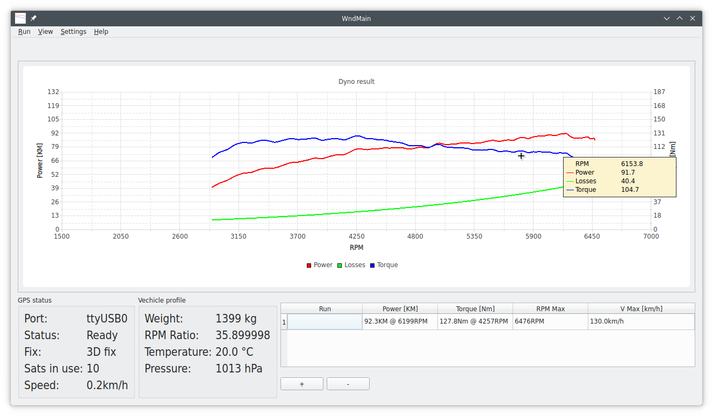
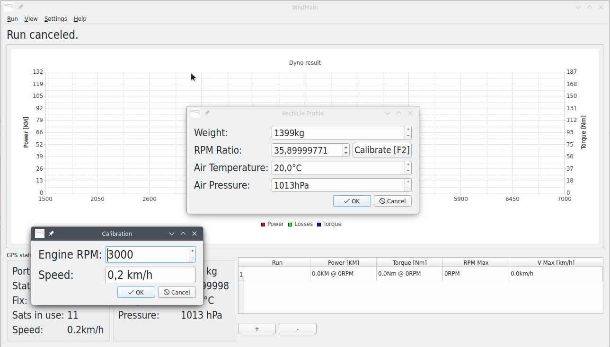
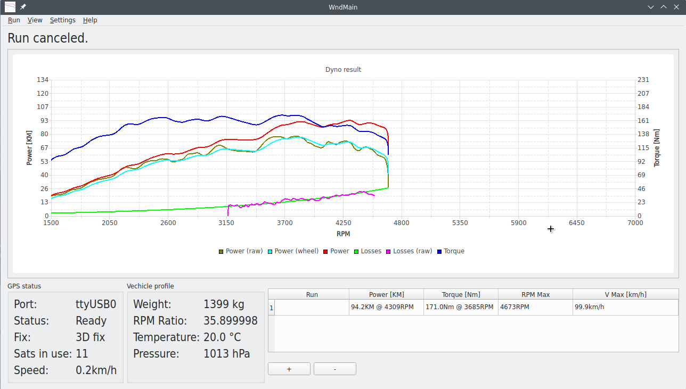

OpenDyno
===
Open dyno is a simple mobile car road dyno that measures power, torque, speed and other parameters in all vechicle types. It is licensed uder MIT license. OpenDyno uses 10Hz GPS module to measure speed, so installation in car is easy and fast.

The project consists of a measurement module (board and microcontroller software written in C++ with Arduino library) and a computer application (written in C++ with QT library). Initially was developed and tested under Linux and QT6.

Project status
===
Open Dyno is currently in public alpha stage.

TODO
===

* Road tests
* Calibration
* Code clean up and optimalization

How it is look?
===

*Main window with one run loaded*

*Vechicle settings & calibration window*

*All data series visible*

